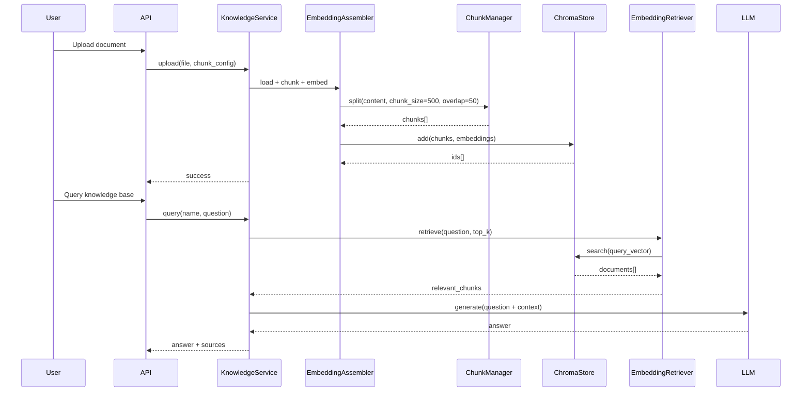
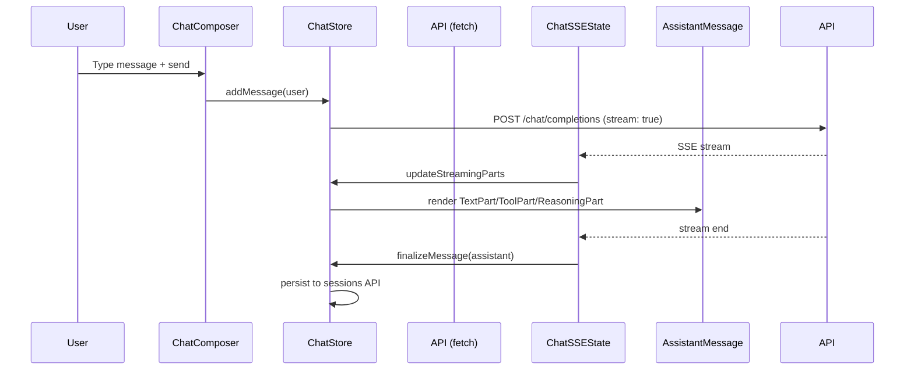

# Aurora Platform -- Technical Design Document

> Version: 0.2.0 | Last Updated: 2026-05-20 | Status: Based on Actual Implementation

## 1. Architecture Overview

Aurora is a monorepo consisting of 5 Python packages and a React frontend. The backend uses a layered architecture with IoC container, while the frontend follows a feature-based module structure with centralized state management.

```mermaid
graph TB
    subgraph "Frontend (React 18 + TypeScript)"
        FE[SPA + Electron Desktop]
    end

    subgraph "API Gateway (FastAPI :8888)"
        API[17 Sub-routers<br/>CORS | Swagger]
    end

    subgraph "Service Layer (aurora-serve)"
        CHAT[ChatService<br/>Multi-round tool calling<br/>Intent routing]
        DS[DatasourceService<br/>SQLite/PG/MySQL/DuckDB]
        KB[KnowledgeService<br/>RAG Pipeline]
        SKILL[SkillService<br/>16 built-in skills]
        FLOW[FlowService<br/>AWEL DAG engine]
        MODEL[ModelService<br/>CRUD + connection test]
        APP[AppService<br/>Chat/Agent/RAG apps]
        OTHER[Files, Prompts, Plugins<br/>Eval, Feedback, Traces, Users]
        PROV[ProviderService<br/>BYOK proxy + CLI daemon]
    end

    subgraph "Core Framework (aurora-core)"
        REG[SystemApp IoC<br/>Lifecycle management]
        MOD[ModelRegistry<br/>OpenAI/Anthropic/Google/Azure/CLI]
        TOOL[ToolSystem<br/>21 built-in tools<br/>Concurrency orchestrator]
        SESS[SessionManager<br/>JSONL persistence<br/>Checkpoint/rollback]
        MEM[MemoryManager<br/>Markdown files<br/>MEMORY.md index]
        HOOK[HookManager<br/>Pre/Post tool hooks]
        CTX[ContextCompactor<br/>200K token limit]
        PROMPT[PromptBuilder<br/>BI/CODE mode sections]
        PERM[PermissionManager<br/>Hierarchical config]
        PLAN[PlanEnforcer<br/>Read-only during planning]
        SUB[SubagentManager<br/>Isolated execution]
        COST[CostTracker<br/>Per-model accounting]
        MCP[MCPClient<br/>JSON-RPC stdin/stdout]
    end

    subgraph "Extension Layer (aurora-ext)"
        RAG[RAG Pipeline<br/>Chunk → Embed → Store]
        VECTOR[ChromaVectorStore<br/>Distance-scored search]
        AWELOP[AWEL Operators<br/>Load/Storage nodes]
    end

    subgraph "Sandbox (Standalone :9000)"
        SANDBOX[DockerCodeExecutor<br/>python:3.11-slim<br/>--network none]
    end

    subgraph "Storage"
        SQLITE[(SQLite<br/>data/aurora.db)]
        CHROMA[(ChromaDB<br/>data/chroma/)]
        FILES[File System<br/>~/.aurora/sessions/<br/>~/.aurora/memory/<br/>data/uploads/]
    end

    FE -->|HTTP/SSE| API
    API --> CHAT & DS & KB & SKILL & FLOW & MODEL & APP & OTHER & PROV

    CHAT --> MOD & TOOL & SESS & MEM & CTX & PROMPT & COST & PLAN
    CHAT -.->|SQL Agent| DS
    CHAT -.->|RAG| KB
    CHAT -.->|Skills| SKILL

    DS --> SQLITE
    KB --> RAG --> VECTOR --> CHROMA
    FLOW --> AWELOP

    TOOL --> HOOK & PERM
    TOOL -.->|Optional| SANDBOX
    CHAT -.->|Optional| SANDBOX

    SESS --> FILES
    MEM --> FILES
    KB --> FILES

    REG --> CHAT & DS & KB & SKILL & FLOW & MODEL & APP
```

## 2. Core Design Decisions

### 2.1 Claude Code Architecture Port

The core framework (`aurora-core`) ports key architectural patterns from Claude Code's TypeScript codebase:

| Component | Origin | Adaptation |
|-----------|--------|-----------|
| Tool System | `toolExecution.ts` | Python ABC with async execution |
| Session Management | `session.ts` | JSONL file persistence with checkpoint/rollback |
| Memory System | `memory.ts` | Markdown files with frontmatter metadata |
| Hooks | `hooks.ts` | Shell command + Python function hooks |
| Context Compaction | `contextManager.ts` | Token-aware with thrashing detection |
| Prompt Builder | `prompt.ts` | Mode-aware (BI/CODE) section assembly |
| Plan Mode | `planMode.ts` | Read-only tool restriction |
| Permissions | `permissions.ts` | Hierarchical config (global→user→project) |
| Subagents | `subagents.ts` | Isolated context, limited tools, timeout |

### 2.2 IoC Container (`SystemApp`)

Inspired by DB-GPT's component system:

```
SystemApp
  ├── register_instance(key, instance)  # Register singleton
  ├── register(key, cls)                # Register class (lazy instantiation)
  ├── get_component(key)                # Resolve component
  └── Lifecycle hooks:
      ├── on_init()     # Component initialization
      ├── after_init()  # Post-initialization setup
      └── before_stop() # Cleanup
```

Components: `BaseComponent` (stateful) and `BaseService` (stateless) with `LifeCycle` mixin.

### 2.3 Tool Orchestration

```python
# Concurrency model
async def run_tools(tool_calls):
    # Partition by concurrency safety
    read_only = [t for t in tool_calls if t.is_read_only and t.is_concurrency_safe]
    write_ops = [t for t in tool_calls if not t.is_read_only]

    # Read-only tools run in parallel
    if read_only:
        await asyncio.gather(*[execute(t) for t in read_only])

    # Write tools run serially
    for t in write_ops:
        await execute(t)
```

### 2.4 Dual Mode Architecture

```python
class ChatMode(Enum):
    BI = "bi"      # Web mode: read-only analysis tools
    CODE = "code"  # Desktop mode: full engineering tools

BI_ALLOWED_TOOLS = frozenset({
    "read", "glob", "grep", "web_fetch", "web_search",
    "ask_user_question", "skill", "task_create", "task_get",
    "task_update", "task_list"
})

CODE_ONLY_TOOLS = frozenset({
    "bash", "write", "edit", "agent", "send_message",
    "notebook_edit", "lsp", "enter_plan_mode", "exit_plan_mode",
    "todo_write"
})
```

### 2.5 Streaming Architecture

**Backend → Frontend SSE flow**:

```
Backend (ChatService)
  ├── Build system prompt (PromptBuilder)
  ├── Call LLM with streaming
  ├── Parse SSE events:
  │   ├── text_start/delta/end
  │   ├── reasoning_start/delta/end
  │   ├── tool_call_start/result
  │   └── pipeline_step
  ├── Multi-round tool calling (up to 5 rounds)
  ├── Context compaction between rounds
  └── Session persistence

Frontend (ChatSSEState)
  ├── Parse SSE stream from fetch response
  ├── Update streamingParts in real-time
  ├── Render TextPart, ToolPart, ReasoningPart, StatusPart
  └── AbortController for cancellation
```

**BYOK proxy flow**:

```
Frontend → Provider Registry → Backend Proxy → Provider API
  ├── /providers/proxy/openai/stream
  ├── /providers/proxy/anthropic/stream
  ├── /providers/proxy/azure/stream
  └── /providers/proxy/google/stream
```

## 3. Data Models

### 3.1 Core Schemas (aurora-core)

```python
# Message types
@dataclass
class ToolCall:
    id: str
    type: str
    function: dict

@dataclass
class Message:
    role: str  # system/user/assistant/tool
    content: str | list | None
    name: str | None
    tool_calls: list[ToolCall] | None
    tool_call_id: str | None
    extra: dict

@dataclass
class ModelOutput:
    text: str
    usage: dict
    finish_reason: str
    tool_calls: list[ToolCall]
    is_reasoning: bool
    extra: dict

# Session types
@dataclass
class SessionMessage:
    type: str  # user/assistant/tool_use/tool_result
    content: str
    role: str
    tool_calls: list
    events: list
    attachments: list
    timestamp: float

@dataclass
class Session:
    id: str  # UUID
    title: str
    project_path: str
    branch: str
    messages: list[SessionMessage]
    checkpoints: dict
    metadata: dict
```

### 3.2 ORM Entities (aurora-serve)

13 SQLAlchemy entities in `data/aurora.db`:

| Entity | Key Fields |
|--------|-----------|
| `ModelConfigEntity` | id, name, type, base_url, api_key, is_default, status |
| `DatasourceEntity` | id, name, db_type, config (JSON) |
| `KnowledgeBaseEntity` | id, name, description, chunk_strategy |
| `KnowledgeDocumentEntity` | id, kb_id, filename, file_path, chunk_count |
| `FileEntity` | id, filename, file_path, mime_type, size |
| `PromptTemplateEntity` | id, name, content, variables (JSON) |
| `FlowEntity` | id, name, description, nodes (JSON), edges (JSON), variables |
| `FlowRunEntity` | id, flow_id, status, inputs, outputs, started_at, finished_at |
| `PluginEntity` | id, name, description, enabled, config |
| `EvaluationDatasetEntity` | id, name, description, data (JSON) |
| `EvaluationTaskEntity` | id, dataset_id, model, status, results |
| `FeedbackEntity` | id, content, rating, session_id |
| `TraceEventEntity` | id, event_type, data, timestamp |
| `UserEntity` | id, name, email, role |
| `AppEntity` | id, name, type, config, knowledge_ids, datasource_ids, skill_ids, published |

## 4. RAG Pipeline Design



## 5. AWEL Workflow Engine Design

```python
# Core primitives
class BaseOperator:
    def __rshift__(self, other):  # >> operator for dependency wiring
        return Dependency(self, other)
    async def execute(self, context): ...

class MapOperator(BaseOperator):
    async def execute(self, context): return self.fn(context)

class BranchOperator(BaseOperator):
    async def execute(self, context):
        return self.true_branch if self.condition(context) else self.false_branch

class DAG:
    operators: list[BaseOperator]
    dependencies: dict[str, list[str]]

class DAGBuilder:
    def add_operator(self, op): ...  # with cycle detection
    def build(self) -> DAG: ...

class DAGExecutor:
    async def execute(self, dag, context): ...  # topological order

class TaskScheduler:
    async def run_parallel(self, tasks): ...  # asyncio.gather
```

## 6. Frontend Component Architecture

### 6.1 Component Hierarchy

```
App.tsx
  BrowserRouter
    AppProviders (QueryClientProvider, I18nProvider, Toaster)
      Routes
        Shell
          Sidebar (desktop)
            BrandLogo
            NavItems (Explore, Chat, Construct)
            ConversationList (on /chat)
            ThemeToggle, LanguageToggle
          [Page Component]
            ConstructShell (on /construct/*)
              TabNavigation (8 tabs)
              [Sub-page Component]
```

### 6.2 Chat Component Tree

```
ChatPane
  ├── ChatHeader (tabs, model selector)
  ├── ChatMessageList
  │   ├── DaySeparator
  │   ├── UserMessage
  │   │   └── ContentParts (text, images, files)
  │   └── AssistantMessage
  │       ├── ReasoningDisplay
  │       ├── MessageRenderer (Markdown)
  │       │   ├── CodeRenderers
  │       │   └── ChartRenderer (ECharts)
  │       ├── ToolCard
  │       ├── StatusPill
  │       └── QuestionForm
  ├── ChatComposer
  │   ├── Textarea
  │   ├── FileAttachments
  │   └── SendButton / StopButton
  └── DebugPipelinePanel
```

### 6.3 State Flow



## 7. Storage Design

### 7.1 File Layout

```
~/.aurora/
  ├── config.toml              # TOML configuration
  ├── settings.json            # Hooks + permissions config
  ├── mcp.json                 # MCP server definitions
  ├── sessions/                # Session persistence
  │   ├── {session-id}/
  │   │   ├── messages.jsonl   # Message history
  │   │   └── .meta.json       # Session metadata
  │   └── ...
  └── memory/                  # Global memory
      ├── MEMORY.md            # Index file
      ├── user_role.md
      ├── feedback_testing.md
      └── ...

.aurora/                       # Project-level config
  ├── settings.json            # Project hooks
  ├── agents/                  # Subagent definitions
  │   ├── code-reviewer.md
  │   └── ...
  └── memory/                  # Project memory
      ├── MEMORY.md
      └── ...

data/
  ├── aurora.db                # SQLite metadata
  ├── chroma/                  # ChromaDB vectors
  └── uploads/                 # Uploaded files

configs/
  └── aurora.toml              # Default configuration
```

### 7.2 JSONL Session Format

```jsonl
{"type":"user","content":"What tables are in the database?","role":"user","timestamp":1716200000}
{"type":"assistant","content":"I'll check the database schema.","role":"assistant","tool_calls":[{"id":"call_1","type":"function","function":{"name":"skill","arguments":"{\"skill_name\":\"DatabaseSchemaSkill\"}"}}],"timestamp":1716200001}
{"type":"tool_result","content":"Tables: users, orders, products","role":"tool","tool_call_id":"call_1","timestamp":1716200002}
{"type":"assistant","content":"The database contains 3 tables: users, orders, and products.","role":"assistant","timestamp":1716200003}
```

## 8. Error Handling Strategy

| Layer | Strategy |
|-------|----------|
| LLM Calls | `@retry_on_transient` with exponential backoff (ConnectError, ReadTimeout, 5xx) |
| Tool Execution | Try/catch per tool, yield ToolResult with error |
| API Endpoints | FastAPI exception handlers, standardized error response |
| Frontend | Axios response interceptor, toast notifications (sonner) |
| Streaming | SSE error events, graceful stream termination |
| Sandbox | Timeout (30s), resource limits, isolated errors |

## 9. Configuration Hierarchy

```
Priority (high → low):
1. Environment variables (AURORA_ prefix)
2. Project config (.aurora/settings.json)
3. User config (~/.aurora/settings.json)
4. TOML config (configs/aurora.toml)
5. Code defaults
```

## 10. Deployment Architecture

### Development
```
Terminal 1: uv run python -m aurora_app.main  (port 8888)
Terminal 2: cd frontend && npm run dev          (port 3000, proxies /api → 8888)
```

### Electron Desktop
```
Electron main.ts
  ├── Start Python backend (uvicorn) on random port
  ├── Health check polling (/api/v1/health)
  ├── Load Vite dev server (dev) or dist/index.html (prod)
  └── IPC: getBackendUrl()
```

### Production Build
```
Frontend: npm run build → dist/
Electron: npm run electron:build → dmg/nsis/AppImage
Backend: pip install aurora-app → uvicorn aurora_app.main:app
```
